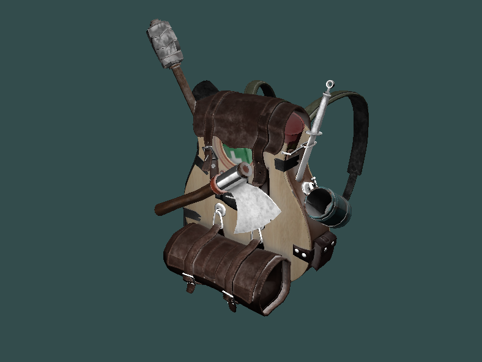

# OGE
## General
OGE is a 3D engine based on OpenGl.

## Getting started
### Sample program
The repo comes with a small sample program that loads a model and renders it with a simple shader program using the Phong shading model. It can be compiled with the makefile in the root folder of the repo.

The sample program looks something like this.

### Camera
```
// The camera is created at a location by passing a position vector to the constructor.
Camera camera(glm::vec3(0.0f, 0.0f, 3.0f));

/*
* The camera has support for FPS style movement and look around with the following
* functions.
*/
// Move the camera around by passing direction 
// as an enum and the length of the frame as deltaTime
camera.ProcessKeyboard(DOWN, deltaTime);

// Rotate the camera by passing x and y offset of the mouse position
camera.ProcessMouseMovement(xoffset, yoffset);

// Zoom by passing scroll wheel offset
camera.ProcessMouseScroll(static_cast<float>(yoffset));
```

### Shaders
```
// Shaders can be packaged as a shader program using the shader class.
// It takes two paths to the vertex and fragment shader.
Shader modelShader("shaders/light_shader.vs", "shaders/light_shader.fs");

// The shader is activated with the use function
modelShader.use();

// Uniforms can be set with the utility functions
modelShader.setVec3("viewPos", camera.Position);
modelShader.setFloat("material.shininess", 0.3f);
```
Note: The sampler2D uniforms containing the textures in the shaders must be called texture_diffuse1, texture_diffuse2 and so on.. Similarly for specular textures, specular_texture1...

### Model loading
```
// Model loading is done with assimp and the model class.
// The model class takes a path to the model .obj file as an argument.
Model model("resources/objects/backpack/backpack.obj");

// The model can then be drawn by passing a shader to the draw function
model.draw(modelShader);
```

## Version history
### 0.1
- Camera class for simple integration of cameras
- Shader class with support for custom vertex and fragment shaders
- Model loading with assimp